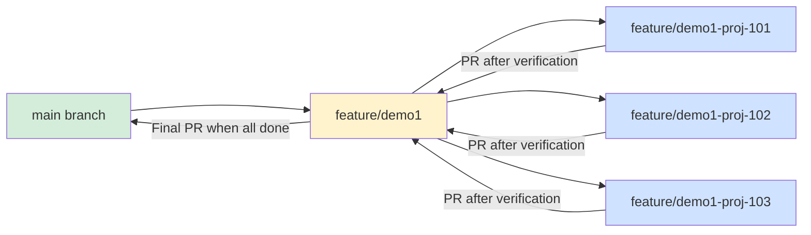
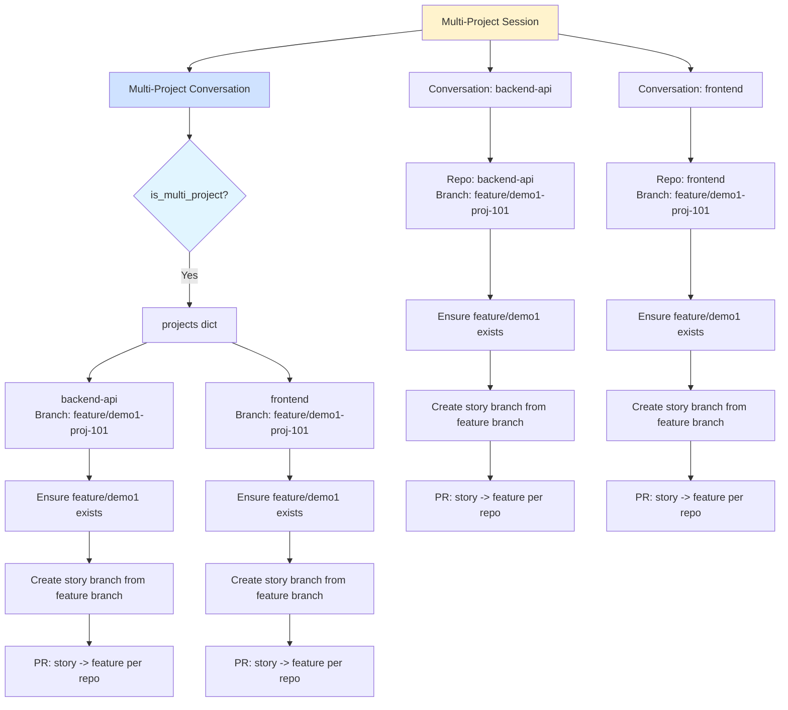
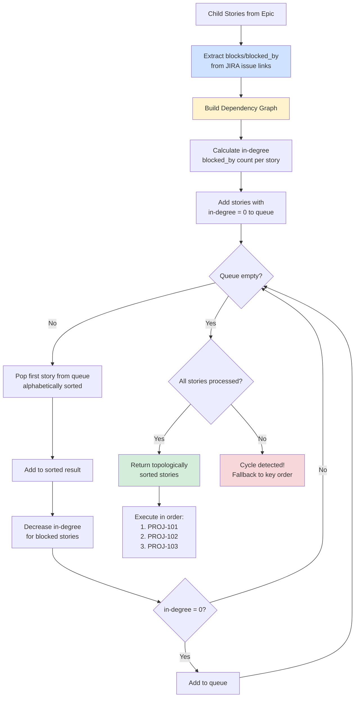

# Feature Orchestration Flow

## Overview

Feature orchestration automates multi-session workflows with integrated verification and branching strategy.

**Quick Start:**
```bash
# Create feature from parent epic
daf -e feature create demo1 --parent PROJ-100

# Run feature (opens first session)
daf -e feature run demo1

# After completing work in Claude, run:
daf complete

# Resume to next session
daf -e feature resume demo1
```

**Key Capabilities:**
- Auto-discovers child stories from parent epic
- Topologically sorts by JIRA dependencies
- Creates dedicated story branches with user choice
- AI-powered verification of acceptance criteria
- Automatic PR creation with rich descriptions
- Updates existing PRs instead of creating duplicates
- JIRA status transitions after PR creation
- Merge story PRs before creating final feature PR

## Complete Workflow

```mermaid
graph TD
    Start[User: daf -e feature create demo1 --parent PROJ-100] --> Discover[Discover Children from Parent Epic]

    Discover --> Filter[Filter by Assignee & Status]
    Filter --> TopoSort[Topological Sort by Dependencies]
    TopoSort --> CreateSessions[Auto-create Sessions for Each Story]
    CreateSessions --> CreateFeature[Create Feature Orchestration Metadata]

    CreateFeature --> Run[User: daf -e feature run demo1]

    Run --> GetFirst[Get First Unblocked Session]
    GetFirst --> OpenSession[Open Session PROJ-101]

    OpenSession --> EnsureFeatureBranch{Feature Branch Exists?}
    EnsureFeatureBranch -->|No| CreateFeatureBranch[Create feature/demo1 from main]
    EnsureFeatureBranch -->|Yes| PromptBranchChoice{User Chooses Branch}
    CreateFeatureBranch --> PromptBranchChoice

    PromptBranchChoice -->|1. New Story Branch| CreateStoryBranch[Create feature/demo1-proj-101<br/>from feature/demo1]
    PromptBranchChoice -->|2. Current Branch| UseCurrentBranch[Continue on Current Branch]
    PromptBranchChoice -->|3. Feature Branch| UseFeatureBranch[Use feature/demo1 Directly]
    PromptBranchChoice -->|4. Other Branch| SelectBranch[Select Existing Branch]

    CreateStoryBranch --> Work[User Works on Story in Claude]
    UseCurrentBranch --> Work
    UseFeatureBranch --> Work
    SelectBranch --> Work

    Work --> Complete[User: daf complete]

    Complete --> Verify{Verification Mode}

    Verify -->|auto-ai| LaunchAI[Launch AI Agent for Verification]
    Verify -->|auto| EvidenceBased[Evidence-based Verification]
    Verify -->|manual| ManualApproval[User Manual Approval]
    Verify -->|skip| SkipVerify[Skip Verification]

    LaunchAI --> ParseCriteria[Re-fetch Description from JIRA<br/>Parse Acceptance Criteria]
    ParseCriteria --> AIPrompt[Build Verification Prompt]
    AIPrompt --> SpawnAgent[Spawn Claude Agent with Criteria]
    SpawnAgent --> AgentVerifies[Agent Checks Files, Runs Tests,<br/>Marks Criteria as Verified]
    AgentVerifies --> CountChecks[Count Verified Criteria]

    EvidenceBased --> ParseCriteria2[Re-fetch Description from JIRA<br/>Parse Acceptance Criteria]
    ParseCriteria2 --> SearchEvidence[Search for Related Files & Tests]
    SearchEvidence --> CountChecks

    ManualApproval --> VerifyPassed
    SkipVerify --> VerifyPassed

    CountChecks --> VerifyStatus{Status?}
    VerifyStatus -->|All Verified| VerifyPassed[Status: PASSED]
    VerifyStatus -->|Some Verified| VerifyGaps[Status: GAPS_FOUND]
    VerifyStatus -->|None Verified| VerifyFailed[Status: FAILED]

    VerifyPassed --> CheckExistingPR{PR Already<br/>Exists?}
    CheckExistingPR -->|Yes| UpdateExistingPR[Push New Commits<br/>Update JIRA]
    CheckExistingPR -->|No| CreateStoryPR{Has Commits Ahead<br/>of Target Branch?}

    CreateStoryPR -->|Yes| CheckFeatureRemote{Feature Branch<br/>on Remote?}
    CreateStoryPR -->|No| TransitionJIRA

    CheckFeatureRemote -->|No| PushFeature[Push Feature Branch<br/>to Remote]
    CheckFeatureRemote -->|Yes| PushStory[Push Story Branch]
    PushFeature --> PushStory

    PushStory --> PRToFeature[Create PR:<br/>Story Branch -> Feature Branch<br/>with Rich Description]
    PRToFeature --> UpdateJIRAPR[Update JIRA with PR URL]
    UpdateJIRAPR --> TransitionJIRA[Prompt: Transition JIRA Status]
    UpdateExistingPR --> TransitionJIRA

    TransitionJIRA --> CheckNext{More Sessions?}

    VerifyGaps --> PauseFeature[Pause Feature]
    VerifyFailed --> PauseFeature
    PauseFeature --> End1[User: Fix issues, then<br/>daf feature resume demo1]

    CheckNext -->|Yes| PromptNext[Prompt: Open Next Session?]
    CheckNext -->|No| AllDone{All Sessions Complete?}

    PromptNext -->|Yes| GetNext[Get Next Unblocked Session]
    PromptNext -->|No| End3[Resume with:<br/>daf open SESSION]
    GetNext --> OpenSession

    AllDone -->|Yes| CheckFinalCommits{Feature Branch has<br/>Commits Ahead of Main?}
    AllDone -->|No| WaitBlocked[Wait for External Dependencies]

    CheckFinalCommits -->|No| MergeStoryPRs[Message: Merge Story PRs First]
    CheckFinalCommits -->|Yes| FinalPR[Create Final PR:<br/>feature/demo1 -> main]

    FinalPR --> UpdateParent[Update Parent Issue with PR URL]
    UpdateParent --> Complete2[Feature Status: COMPLETE]
    MergeStoryPRs --> Complete2

    WaitBlocked --> End2[Feature Paused<br/>Resume when dependencies clear]

    style Start fill:#e1f5ff
    style Run fill:#e1f5ff
    style Complete fill:#e1f5ff
    style VerifyPassed fill:#d4edda
    style VerifyGaps fill:#fff3cd
    style VerifyFailed fill:#f8d7da
    style Complete2 fill:#d4edda
    style LaunchAI fill:#cfe2ff
    style SpawnAgent fill:#cfe2ff
    style AgentVerifies fill:#cfe2ff
    style UpdateExistingPR fill:#d4edda
    style PRToFeature fill:#d4edda
    style TransitionJIRA fill:#fff3cd
    style MergeStoryPRs fill:#fff3cd
    style FinalPR fill:#d4edda
```



## Branching Strategy



## Multi-Project Support



## Verification Modes

```mermaid
graph TD
    Verify[Verification Mode] --> AutoAI[auto-ai<br/>DEFAULT]
    Verify --> Auto[auto<br/>Evidence-based]
    Verify --> Manual[manual<br/>User approval]
    Verify --> Skip[skip<br/>No verification]

    AutoAI --> RefetchJIRA1[Re-fetch description from JIRA<br/>Preserves formatting]
    Auto --> RefetchJIRA2[Re-fetch description from JIRA<br/>Preserves formatting]

    RefetchJIRA1 --> ParseAI[Parse acceptance criteria<br/>from h3. Requirements section]
    RefetchJIRA2 --> ParseAuto[Parse acceptance criteria<br/>from h3. Requirements section]

    ParseAI --> SpawnClaude[Spawn Claude agent<br/>with criteria checklist]
    ParseAuto --> SearchFiles[Search for related files & tests]

    SpawnClaude --> AgentCheck[Agent verifies each criterion<br/>Marks as [x] when verified]
    SearchFiles --> CountEvidence[Count evidence found]

    AgentCheck --> CountMarks[Count [x] marks<br/>Cap at total criteria]
    CountMarks --> Result1{verified >= total?}
    CountEvidence --> Result2{evidence > 0?}

    Result1 -->|Yes| Passed1[PASSED]
    Result1 -->|Partial| Gaps1[GAPS_FOUND]
    Result1 -->|No| Failed1[FAILED]

    Result2 -->|Yes| Passed2[PASSED]
    Result2 -->|No| Failed2[FAILED]

    Manual --> UserPrompt[Prompt user]
    UserPrompt --> Passed3[PASSED]

    Skip --> Skipped[SKIPPED]

    style AutoAI fill:#d4edda
    style Auto fill:#fff3cd
    style Manual fill:#cfe2ff
    style Skip fill:#f8d7da
```

## Dependency Resolution



## Key Features

### 1. Auto-Discovery
- Fetches child stories from parent epic in JIRA
- Filters by assignee and status
- Topologically sorts by dependencies
- Auto-creates sessions for each story

### 2. Branching Strategy
- **Feature branch**: `feature/{name}` created from main
- **Story branches**: User chooses branch strategy when opening each session:
  - Create new story branch: `feature/{name}-{issue-key}` from feature branch (default)
  - Use current branch: Continue work on existing branch
  - Use feature branch: Work directly on feature branch (no story branch)
  - Select existing branch: Reuse any local branch
- **Story PRs**: Rich PRs with feature context, JIRA links, commits, and changed files
  - Created when story branch has commits ahead of feature branch
  - Automatically updates existing PRs with new commits
  - Detects existing open PRs to avoid duplicates
- **Final PR**: Merge feature branch -> main after all story PRs merged
  - Only created if feature branch has commits ahead of main
  - Prompts to merge story PRs first if feature branch is empty

### 3. Multi-Project Support
- Two patterns: Multi-conversation OR single multi-project conversation
- Feature branch created in **all repos** involved in each story
- Story PRs created per repo
- Ensures consistency across microservices

### 4. AI-Powered Verification (default)
- Re-fetches description from JIRA to preserve formatting
- Parses acceptance criteria from structured sections
- Spawns AI agent (Claude/Copilot/Ollama) with checklist
- Agent verifies by checking files, running tests, etc.
- Counts verified criteria (capped at total to prevent over-counting)

### 5. Dependency Management
- Uses JIRA "blocks"/"is blocked by" relationships
- Topological sort ensures correct execution order
- Blocks feature if external dependencies not complete
- Supports team collaboration (tracks external sessions)

### 6. Workflow Timing
After verification passes for each story:
1. **Create/Update Story PR** - Story branch → Feature branch
   - Checks for existing open PR
   - If exists: pushes new commits and updates JIRA
   - If new: creates PR with rich description (feature context, commits, files)
2. **Update JIRA** - Adds PR URL to "Git Pull Request" field
3. **Transition JIRA Status** - Prompts user to change status (e.g., In Progress → Code Review)
4. **Prompt for Next Session** - Asks to open next session or exit
5. **Final PR Creation** - After all sessions complete
   - Verifies feature branch has commits (story PRs must be merged)
   - Creates final PR: feature branch → main
   - Updates parent epic with final PR URL

## Commands

```bash
# Create feature from parent epic
daf -e feature create demo1 --parent PROJ-100

# Run feature (opens first unblocked session)
daf -e feature run demo1

# Resume feature (after fixing verification gaps)
daf -e feature resume demo1

# Check feature status
daf -e feature status demo1

# List all features
daf -e feature list

# Delete feature (with options)
daf -e feature delete demo1 --delete-sessions --delete-branch
```

## Configuration

### Verification Modes
- `auto-ai` (default): AI agent verification
- `auto`: Evidence-based verification
- `manual`: User approval
- `skip`: No verification

### Example
```bash
daf -e feature create demo1 --parent PROJ-100 --verify auto-ai
```

## Troubleshooting

### "No commits between main and feature/demo1"
**Cause:** Story PRs haven't been merged into feature branch yet
**Solution:**
1. Review and merge all story PRs (story branches → feature branch)
2. Then run: `daf -e feature complete demo1`

### "PR already exists" when resuming
**Behavior:** This is normal - the system detects existing PRs and updates them
**What happens:**
- Pushes any new commits to the existing PR
- Updates JIRA with the PR URL
- Continues to JIRA transition prompt

### Feature shows wrong current session
**Cause:** Session status mismatch (using old "completed" vs new "complete")
**Solution:** Feature was likely created before status standardization
**Fix:** Delete and recreate feature: `daf -e feature delete NAME --delete-sessions --delete-branch`

### Story branch exists but wrong branch is checked out
**Behavior:** Branch selection prompt appears on every `daf open`
**Purpose:** Allows flexibility to:
- Continue on existing story branch
- Switch to current branch (if you want to reuse branches)
- Use feature branch directly (no story branch)
- Select any other existing branch

## Best Practices

### Branch Strategy
- **Independent stories:** Create separate story branches (default option 1)
- **Sequential dependent stories:** Use current branch or feature branch to build on previous work
- **Shared changes across stories:** Use feature branch directly (option 3)

### Code Review Workflow
1. Complete story → Verification passes → Story PR created
2. Review story PR (story branch → feature branch)
3. Approve and merge story PR into feature branch
4. Repeat for all stories
5. After all story PRs merged → Create final PR (feature → main)
6. Review final PR (aggregated changes)
7. Merge final PR to main

### JIRA Status Management
- **After verification:** Manually transition to "Code Review" (recommended)
- **After PR merged:** Manually transition to "Done" or "Closed"
- **Auto-transition:** Configure in `~/.daf-sessions/config.json` for automated transitions

### Multi-Project Features
- Ensure all repos are in same state before starting feature
- Story PRs created per repository (one PR per repo per story)
- Merge story PRs consistently across all repos
- Final PR targets the same base branch in all repos

### Verification
- Use `auto-ai` (default) for comprehensive AI-powered verification
- Use `auto` for faster evidence-based verification
- Use `manual` when acceptance criteria aren't well-defined
- Use `skip` only for trivial changes or exploratory work
